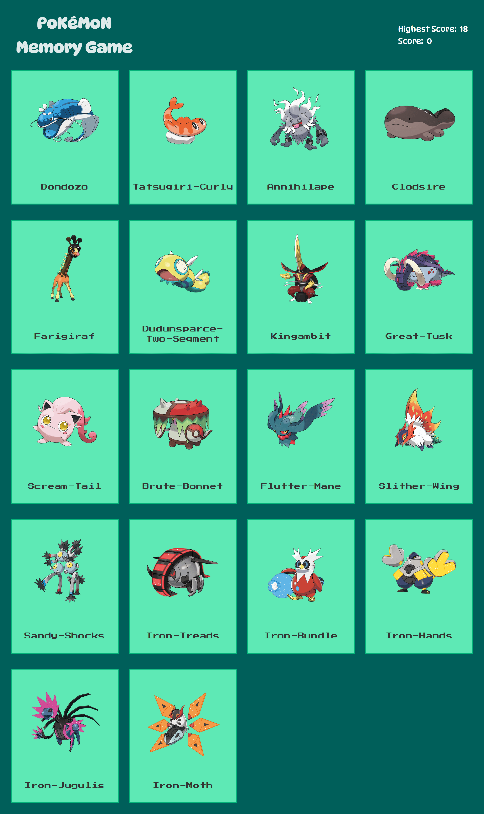

# 🃏 Memory Card Game

A React-based game to test your memory!
Used [PokeAPI](https://pokeapi.co/) to fetch data to display as cards.

## 🔗 Links and 📸 Preview

- **Live Demo:** [View The Live Site](https://memory-card-k9w.pages.dev/)

  

## 🎮 How to Play

1. The game displays a set of Pokémon cards.
2. Click on a card to earn a point.
3. After every click, the cards will **shuffle** their order.
4. **The Catch:** Do not click the same card twice! If you do, your score resets to zero.
5. Try to reach the maximum score by clicking every card exactly once.

## 🧠 What I Learned

- **`useEffect`**: Handled side effects like fetching data from the [PokeAPI](https://pokeapi.co/) on component mount.
- **Shuffling Logic**: Implemented Fisher-Yates shuffle algorithm to randomize card positions after every click.

## 🛠️ Tech Stack

- **Frontend:** React + Vite
- **Styling:** CSS3
- **Data Source:** [PokeAPI](https://pokeapi.co/)
- **Deployment:** [Cloudfare Pages](https://pages.cloudflare.com/)

---
